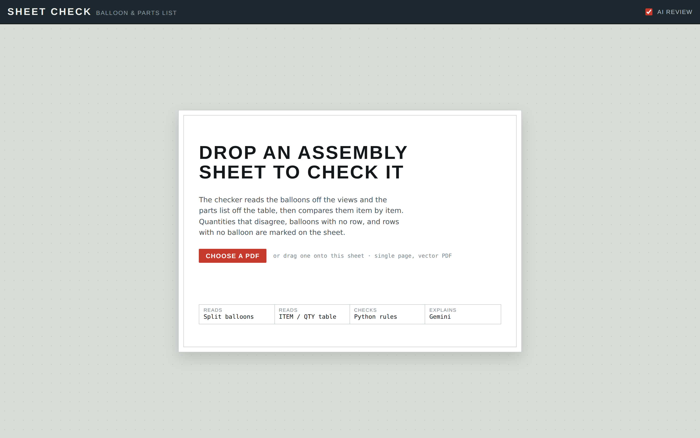
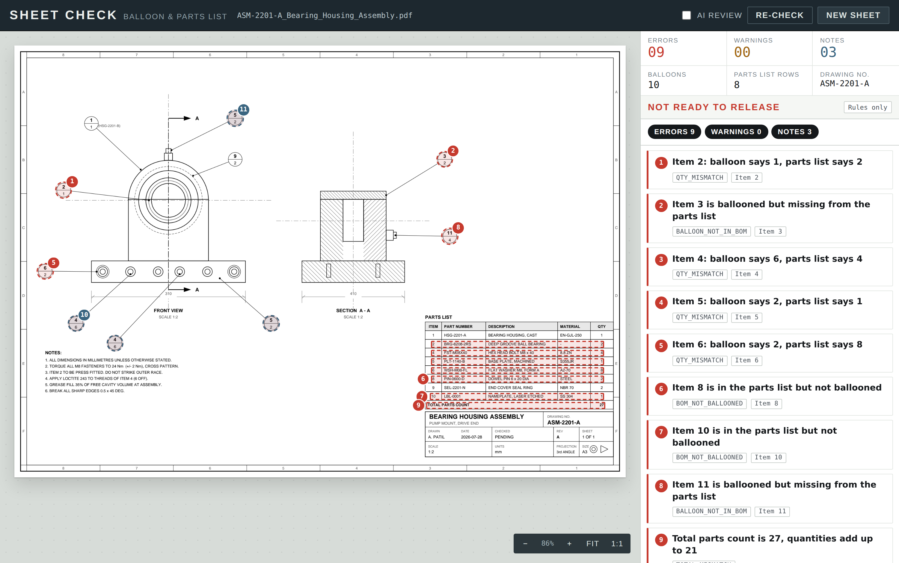
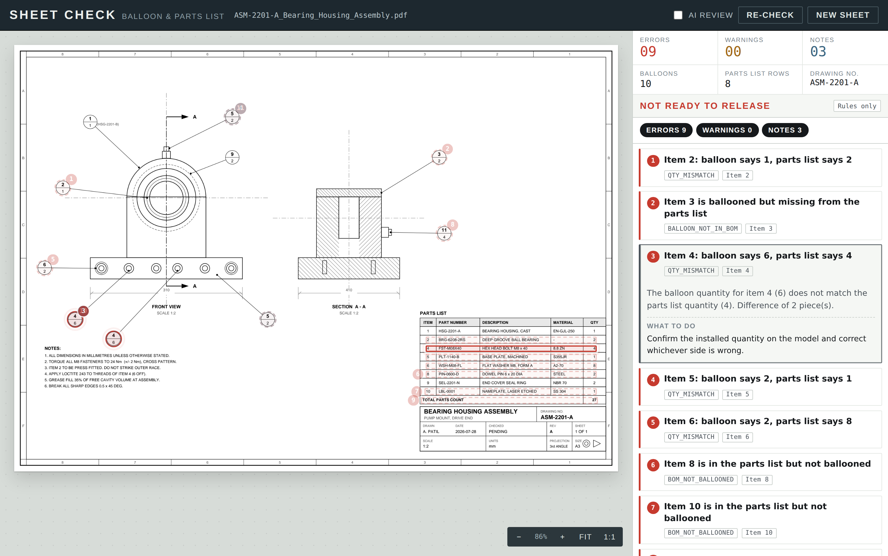

# Sheet Check — balloon vs parts list checker

Upload an assembly drawing PDF. The app reads the balloons off the views and the
parts list off the table, compares them item by item, marks every disagreement on
the sheet, and explains each one in the sidebar.

Python does the counting, Gemini does the explaining.

## Screenshots

|  |  |
|---|---|
|  |  |
| Drop a sheet in | Every mismatch is marked on the drawing and listed in the sidebar |


*Rules-only mode shown above — no `GEMINI_API_KEY` was set when these were taken. With a key configured, the sidebar also shows the AI-discovered issues (leader notes that disagree with the parts list, etc.) alongside these rule-based ones.*

```
React + TypeScript (esbuild, no Vite)          FastAPI
┌───────────────────────────┐  multipart  ┌──────────────────────────────┐
│ drop PDF                  │ ──────────► │ pdfplumber  extract balloons │
│ sheet view + red markers  │             │             extract BOM      │
│ sidebar with descriptions │ ◄────────── │ pypdfium2   render page PNG  │
└───────────────────────────┘    JSON     │ rules.py    exact checks     │
                                          │ ai.py       Gemini review    │
                                          └──────────────────────────────┘
```

## Run it

**Backend**

```bash
cd backend
python -m venv .venv && source .venv/bin/activate      # Windows: .venv\Scripts\activate
pip install -r requirements.txt
cp .env.example .env                                   # then paste your Gemini key in
uvicorn app:app --reload --port 8000
```

Get a key at <https://aistudio.google.com/apikey>. Without one the app still runs —
every deterministic check works, and the sidebar shows "Rule checks only".

**Frontend**

```bash
cd frontend
npm install
npm run dev        # http://localhost:3000, calls the API on :8000
```

For a single-process setup, run `npm run build` instead: FastAPI then serves the
built UI from <http://localhost:8000>.

`npm run typecheck` runs `tsc --noEmit`.

## How the sheet is read

**Balloons.** Small circles in the page geometry that contain at least one digit.
Requiring text inside is what separates a balloon from a bolt head, a washer or a
hole. Text above the divider is the item number, text below is the quantity; a
balloon with a single number is read as item-only. Any short annotation sitting
beside the balloon (a part number quoted on the leader, for example) is captured
and handed to the AI pass.

**Parts list.** The header row is found by looking for `ITEM` and `QTY` on the same
baseline — `PART NUMBER`, `DESCRIPTION` and `MATERIAL` are matched too, with common
alternatives like `POS`, `QUANTITY` and `MATL`. Column boundaries come from the
table's own vertical ruling lines when it has them, which is far more accurate than
guessing from header positions, and fall back to header midpoints when it doesn't.
Rows are grouped by baseline and clipped to the table's ruled extent so sheet
furniture (zone letters, dimension text) can't be mistaken for a row.

## What it checks

Exact, in `rules.py`:

| Code | Meaning |
| --- | --- |
| `QTY_MISMATCH` | balloon quantity ≠ parts list quantity |
| `BALLOON_NOT_IN_BOM` | item is ballooned but has no row |
| `BOM_NOT_BALLOONED` | row exists but the item is never ballooned |
| `BALLOON_QTY_CONFLICT` | two balloons for one item state different quantities |
| `BALLOON_DUPLICATE` | the same item is ballooned more than once |
| `BOM_DUPLICATE_ITEM` | the same item number appears on two rows |
| `BOM_QTY_MISSING` | blank or non-numeric quantity cell |
| `TOTAL_MISMATCH` | stated total ≠ sum of the QTY column |
| `ITEM_SEQUENCE_GAP` | gaps in the item numbering |
| `BALLOON_UNREADABLE` | a balloon was found but its number could not be read |

Gemini, in `ai.py`, does two things on top: it writes the consequence for each rule
hit, and it looks for the problems arithmetic cannot see — a part number quoted in a
leader note that disagrees with the row, a general note that contradicts a quantity,
a view that visibly shows a different number of instances than the balloon claims,
one item number used on two obviously different parts.

**Gemini never returns coordinates.** It refers to balloon ids and item numbers, and
the server resolves those to boxes it already measured. A hallucinated bounding box
therefore cannot put a marker in the wrong place.

## API

`POST /api/analyze` — multipart: `file` (PDF), `page` (0-based, default 0),
`use_ai` (default true).

```jsonc
{
  "page_image": "data:image/png;base64,...",
  "sheet": { "page_width": 1190.55, "page_height": 841.89, "balloons": [...], "bom_rows": [...] },
  "issues": [{
    "id": "R6", "code": "QTY_MISMATCH", "severity": "error",
    "title": "Item 4: balloon says 6, parts list says 4",
    "detail": "...", "recommendation": "...", "item": "4",
    "targets": [{ "kind": "balloon", "bbox": [112.5, 528.4, 139.5, 555.4] }],
    "source": "rule+ai"
  }],
  "summary": { "total": 12, "error": 9, "warning": 0, "info": 3 },
  "ai": { "status": "ok", "message": "Reviewed by Gemini." }
}
```

Boxes are `[x0, y0, x1, y1]` in PDF points with the origin at the top-left of the
page, so the frontend converts to percentages and the overlay stays correct at any
zoom.

`GET /api/health` reports whether a Gemini key is configured.

## Limits

Vector PDFs only — a scanned sheet has no text or geometry to read, and would need
OCR plus circle detection first. One page per run. The parts list must be a real
table with `ITEM` and `QTY` headings. Balloon geometry must be circular; hexagonal
and square balloons are not detected yet.

## Layout

```
backend/
  app.py         FastAPI routes
  extractor.py   balloon + parts list extraction, page render
  rules.py       deterministic cross-checks
  ai.py          Gemini call and result merge
frontend/
  build.mjs      esbuild build / dev server
  src/App.tsx    state, upload, selection
  src/components/SheetView.tsx    zoom, pan, overlay markers
  src/components/IssuePanel.tsx   stamp, filters, issue cards
  src/components/Dropzone.tsx     empty state
```
